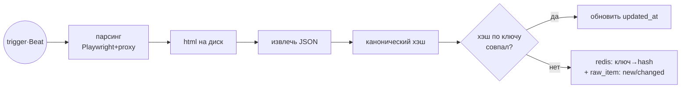
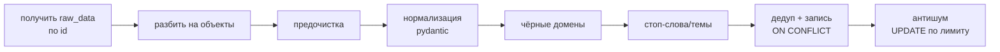
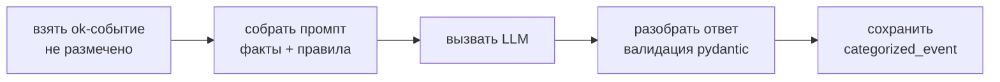
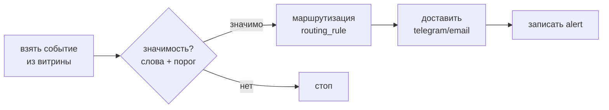
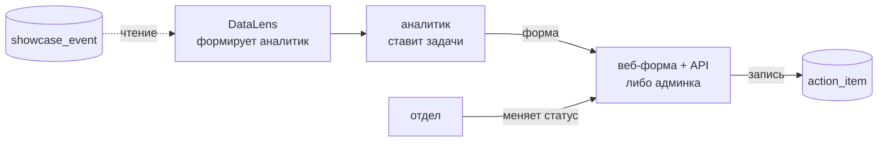
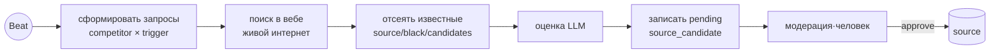

# Система автоматизированной конкурентной разведки «Кодик» — рабочие заметки по бэкенду

Документ фиксирует всё, что проговорили при разборе ТЗ и проектировании конвейера.
Роль автора: **разработчик бэкенда**. Первоисточник требований: `ТЗ_бизнес_процессы_и_RoadMap.docx`.
Здесь — описание всех 7 бизнес-процессов, схемы конвейеров и полная модель данных (DBML).

---

## 0. Что за система (верхний уровень)

Система автоматизированной **конкурентной разведки** (competitive intelligence) — ETL/ELT-конвейер,
который заменяет ручной мониторинг конкурентов. Работает **сама по расписанию, без человека в цикле**.
Аналитик остаётся контролёром качества и принимает решения.

Целевой поток (TO-BE):

```
Автосбор по триггерам → очистка + дедупликация → LLM-категоризация → витрина (СУБД) → BI-дашборд + алерты → постановка задач для менеджеров
```

### Стек

| Слой | Технологии |
|------|-----------|
| Сбор | `httpx` (async) + `pydantic`; `Playwright` для RPA-сайтов |
| Оркестрация | **Celery + Redis** (очередь, ретраи, изоляция сбоев), Celery Beat (расписание) |
| API-слой / админка | **FastAPI + SQLAlchemy (async) + pydantic**; авто-админка — **SQLAdmin или FASTAdmin** (НЕ DRF) |
| Хранилище | **PostgreSQL** (источник правды), **Redis** (отпечатки/кэш), файлы/MinIO (сырой HTML) |
| LLM (BP-3, BP-7) | отдельный сервис; обогащаем только new/changed |
| BI (BP-6) | Яндекс DataLens / Metabase — подключается к витрине напрямую (не наша зона) |

**Почему FastAPI, а не DRF:** весь конвейер асинхронный (`httpx`, async SQLAlchemy, Playwright),
DRF синхронный и использует свои сериализаторы вместо pydantic. FastAPI + SQLAdmin закрывают и API, и админку,
pydantic переиспользуется как есть. Запасной вариант при django-центричности — Django Ninja (pydantic + async), но не DRF.

### Раскладка хранилищ (главный принцип)

| Данные | Где | Зачем |
|--------|-----|-------|
| Сырой HTML-снапшот | Файл / MinIO | аудит, переразбор без повторного захода на сайт |
| Слои bronze/silver/gold | **Postgres** | источник правды, история, запросы |
| Хэши дедупа, счётчики | **Redis** | быстрые проверки «менялось/нет», TTL |
| Справочники (правила, реестры) | Postgres | настраиваемость без кода |

**Redis — НЕ хранилище данных и НЕ история.** История — только в Postgres. Redis можно стереть — пересоберётся.

### Слои данных

```
raw_item (bronze) → normalized_item (silver) → categorized_event (gold) → showcase_event (витрина/представление)
```

---

## Обзор 7 процессов

| BP | Что делает | Триггер | Зона бэкенда |
|----|-----------|---------|--------------|
| BP-1 | Сбор сырья из источников по триггерам | Celery Beat (расписание) | да (ядро) |
| BP-2 | Очистка, нормализация, дедуп, фильтр шума | новые строки в `raw_item` | да |
| BP-3 | LLM-категоризация (приоритет, категория, тональность…) | новые `ok` в `normalized_item` | datasince |
| BP-4 | Витрина (плоская таблица под BI) | новые строки в `categorized_event` | да |
| BP-5 | Детектор значимых событий + алертинг + маршрутизация | новые строки в витрине | да |
| BP-6 | Дашборды + план действий | человек | DataLens + тонкий бэкенд (план действий) + front|
| BP-7 | Админка (CRUD справочников) + агент расширения источников | Beat / человек | да |

---

## BP-1 · Сбор сырья(Backend)

**Назначение:** автоматически получить сведения о конкурентах из внешних источников по триггерам.

**Одна задача Celery** (внутри — обычные функции по шагам). Гранулярность ретраев — не отдельными задачами,
а выборочно: сетевые ошибки ретраим (`tenacity`), ошибки разбора НЕ ретраим (пишем `status=error`).
Опционально можно разбить на 2 задачи (fetch / parse), чтобы разбор повторялся от сохранённого HTML без захода на сайт.

### Pipeline



### Итог BP-1 — строка в `raw_item`

Одна строка = одна выгрузка (снимок страницы).

| поле | значение (пример) |
|---|---|
| `id` | `1` |
| `search_task_id` | `1` — ссылка на задачу-конфиг (он же ключ в Redis) |
| `status` | `new` |
| `content_hash` | `a3f9c1e8b2...` — хэш канонического JSON |
| `raw_data` | JSONB — см. ниже |
| `html_file_path` | `/snapshots/1/2026-07-18T10-00.html` |
| `source_request_url` | `https://hh.ru/search/vacancy?text=Бегемот+Python` |
| `error_message` | `NULL` |
| `created_at` | `2026-07-18 10:00:00` |
| `updated_at` | `2026-07-18 10:00:00` |

Параллельно в Redis: `search_task:1 → "a3f9c1e8b2..."`, на диске — HTML-снимок.

### Содержимое `raw_data`

```jsonc
{
  "meta": {
    "search_task_id": 1,                              // ссылка на задачу-конфиг (= ключ в Redis)
    "source": "hh.ru",                                // с какого ресурса собрали
    "competitor": "Бегемот",                          // по какому конкуренту искали
    "trigger": "Python",                              // по какому слову (может быть null)
    "source_request_url": "https://hh.ru/search/...", // НАШ поисковый запрос, один на всю выгрузку
    "fetched_at": "2026-07-18T10:00:00Z"              // время съёма; в хэш НЕ включаем (иначе всегда changed)
  },
  "items": [                                          // список событий с одной страницы
    {
      "url":    "https://hh.ru/vacancy/101",          // ссылка на КОНКРЕТНОЕ событие -> dedup_key + media_domain
      "title":  "Python-разработчик",                 // заголовок -> вход для стоп-слов
      "text":   "Описание вакансии...",               // тело -> вход для стоп-слов
      "date":   "18 июля 2026",                       // сырая дата -> published_at (ISO)
      "region": "Москва",                             // сырой регион -> lookup в region
      "media":  null,                                 // публикатор: у hh пусто, у новостей = СМИ
      "salary": "150000-200000 руб."                  // сырая строка -> salary_from / salary_to
    }
  ]
}
```

`meta.source_request_url` (наш запрос) и `items[].url` (ссылка на событие) — **два разных URL**, путать нельзя.


### Ключевые решения

1. **Перед стартом заполнить справочники** — `competitor`, `source`, `trigger` и матрицу `search_task`.
   Без них Beat нечего перебирать: он читает активные строки `search_task` и на каждую ставит задачу в очередь.
2. **Ключ и хэш оставляем как есть.** Ключ Redis = `search_task_id`, значение = последний хэш;
   хэш считаем от **канонического** JSON (sorted keys, без плавающих полей вроде `fetched_at`).
   Проверка = **GET + сравнение значений**, а не проверка существования ключа.
3. **Статусы:**
   - **новый** JSON (ключа в Redis нет) → **новая строка**, `status = new`;
   - **повтор** (хэш совпал) → строку не создаём и `status` **не трогаем**, обновляем только `updated_at`;
   - **обновлённый** (хэш другой) → **новая строка** с новыми данными и `status = changed`;
     старая остаётся историей, в Redis перезаписываем хэш.
4. **`error`** — строка с пустым контентом (поля nullable) + `error_message`. Пишем только после исчерпания ретраев.
5. **HTML** — сохраняем всегда (резерв для переразбора); при совпадении хэша (ничего не изменилось) дубль HTML удаляем.

**Таблицы:** `competitor`, `source`, `trigger`, `search_task` (M2M-конфиг, id = ключ Redis), `raw_item`.

---

## BP-2 · Очистка, дедупликация, фильтрация(Backend)

**Назначение:** привести сырьё к единому виду, отсечь дубли и нерелевантное до категоризации.

**Отдельная задача Celery**, триггерится новыми строками `raw_item`. Между этапами передаётся **id**, а не JSON;
BP-2 сам читает `raw_data` по id (отвязка от BP-1, можно переразобрать).
### Pipeline


### Итог BP-2 — строка в `normalized_item`

Один объект из `raw_data.items[]` → одна строка. Только ФАКТЫ, смыслов тут нет.

| поле | значение (пример) |
|---|---|
| `id` | `1` |
| `raw_item_id` | `1` — ссылка НАЗАД на сырьё (drill-down) |
| `competitor_id` | `3` → «Бегемот» (lookup в `competitor`) |
| `region_id` | `7` → «Москва» (lookup в `region`) |
| `source_id` | `1` → «hh.ru» (из `raw_item → search_task`) |
| `published_at` | `2026-07-18` (из `"18 июля 2026"`) |
| `title` | `Python-разработчик` |
| `media_name` | `NULL` — у hh публикатора нет |
| `media_domain` | `hh.ru` — вырезан из `items[].url` |
| `url` | `https://hh.ru/vacancy/101` |
| `text` | `Описание вакансии...` — тело; вход для стоп-слов и для промпта BP-3 |
| `extra` | `{"salary_from":150000,"salary_to":200000,"currency":"RUB"}` — источник-специфичные факты |
| `dedup_key` | `9f2a4c7e...` — хэш бизнес-полей (см. п.4) |
| `status` | `ok` |
| `reject_reason` | `NULL` |
| `created_at` | `2026-07-18 10:05:00` |


### Ключевые решения

**1. Перед стартом заполнить справочники:** `region` (сырое имя → красивое), `black_domain` (домены-публикаторы
в чёрном списке), `stop_word` (стоп-слова / стоп-темы / ложные срабатывания, по `type`), `topic_limit` (лимиты анти-шума).
`competitor`, `source`, `trigger` уже заполнены с BP-1.

**2. Проверка на чёрные списки.**
Смотрим **не колонки `raw_item`**, а поле внутри сырого JSON — ссылку самого события:

```
raw_data["items"][i]["url"]  →  urlparse(url).netloc  →  сравниваем с  black_domain.domain (is_active = true)
```

Совпало → заводим в памяти `status = "rejected"`, `reject_reason = "black_domain"` и делаем **короткое замыкание**:
стоп-слова уже **не проверяем** (смысла нет, объект и так отсеян), сразу идём в дедуп и сохраняем строку с этим статусом.
Дедуп при этом всё равно нужен — чтобы не спамить БД повторами одного и того же отсеянного события.

Нюанс: у hh все `media_domain` = `hh.ru`, поэтому фильтр там холостой. Он работает на новостных источниках,
где в одной выдаче намешаны разные публикаторы.

**3. Проверка на стоп-слова** (только если ЧС не сработал).
Смотрим текстовые поля события:

```
raw_data["items"][i]["title"] + ["text"]  →  lowercase  →  ищем вхождения  stop_word.phrase (is_active = true)
```

Совпало → `status = "rejected"`, а `reject_reason` берём из `stop_word.type`: `stop_word` / `stop_topic` / `false_positive`.
Дальше так же короткое замыкание → дедуп → сохранение с этим статусом.

**4. Дедуп — ключ не URL, а хэш бизнес-полей.**
URL как ключ не годится: одна и та же новость на трёх сайтах даёт **три разных URL**, и по URL они не склеятся.
Поэтому `dedup_key` = хэш от полей, которые одинаковы у одного события независимо от площадки:

```python
import hashlib, re

def norm(s: str) -> str:                       # без этого «Бегемот» и "Бегемот" дадут разные хэши
    s = (s or "").lower()
    s = re.sub(r"[^\w\s]", "", s)              # убрать кавычки/пунктуацию
    return re.sub(r"\s+", " ", s).strip()      # схлопнуть пробелы

dedup_key = hashlib.sha256(
    f"{competitor}|{norm(title)}|{published_at}|{region}".encode()
).hexdigest()
```

**Отдельного SELECT «а есть ли уже такой?» не делаем.** Проверку выполняет сама база:
на `dedup_key` стоит **UNIQUE**, а поведение при совпадении задаёт `ON CONFLICT`:

- **`ON CONFLICT DO NOTHING`** — обычный инкрементальный прогон. Дубль молча пропускается,
  остальная пачка вставляется (без этого вся вставка упала бы с ошибкой на первом же повторе).
- **`ON CONFLICT DO UPDATE`** — переразбор того же сырья с **изменёнными правилами**
  (поправили справочники и прогнали заново): обновляет `status` / `reject_reason` у существующей строки, дублей не плодит.

Две честные оговорки:
- Хэш ловит только **точные** совпадения заголовка. Переформулированную перепечатку
  («Бегемот выиграл тендер» vs «Компания Бегемот победила в конкурсе») он не склеит — для этого нужен нечёткий
  матч (триграммы / simhash), это задел на потом.
- Обратный риск: для **вакансий** два разных объявления с одинаковым заголовком, регионом и датой у одного конкурента
  схлопнутся в одно. Поэтому для источников с надёжным уникальным URL и без перепечаток (джоб-борды, реестры)
  в хэш добавляем ещё и `url`. Стратегию дедупа логично хранить на уровне источника.

**5. Антишум** — аггрегатный фильтр, идёт ПОСЛЕ дедупа и ПОСЛЕ вставки.
Смотрим уже лежащие в БД строки и сравниваем со справочником:

```
normalized_item (status = 'ok')  →  группируем по полю из topic_limit.scope
                                     (competitor_id / media_domain / region_id)
                                     за окно topic_limit.window (прогон / день / неделя)
                                  →  сравниваем COUNT группы с topic_limit.max_count
```

Всё сверх лимита (самые старые в группе) получает `UPDATE ... status = 'rejected', reject_reason = 'noise_limit'`.

Почему после дедупа и после вставки: считать надо **уникальные** события, а окно «неделя» включает строки
из **прошлых прогонов**, которые лежат в БД, а не в текущей пачке в памяти.

**Отсеянное не удаляем** — во всех трёх фильтрах ставим `status = rejected` + причину.
Аналитик разбирает отсев и настраивает правила (цикл «контроль качества → правила» из ТЗ).


**6. ИИ в BP-2 не нужен** — правила дешёвые, прозрачные и правятся аналитиком без кода.
Семантику («Бегемот» компания vs животное) добивает LLM в BP-3; тащить её сюда — дублировать BP-3.

**Таблицы:** справочники `region`, `black_domain`, `stop_word` (по `type`), `topic_limit`; выход — `normalized_item` (silver, только ФАКТЫ).

---

## BP-3 · LLM-категоризация(Datasince)

**Назначение:** разметить каждое событие (приоритет, категория, тональность, отдел…) по правилам аналитика.

**Отдельная задача Celery**. Гоним через LLM только `status=ok` и только **некатегоризированные** (LLM дорогой). Ретраи на сбои API.

### Итог BP-3 — строка в `categorized_event`

Одна строка фактов ↔ одна строка разметки. В колонке «кто» видно, что именно делает LLM, а что код.
### Pipeline


| поле | значение (пример) | кто заполняет |
|---|---|---|
| `id` | `1` | БД |
| `normalized_item_id` | `1` → «Бегемот выиграл тендер в школы Калуги» | код |
| `priority` | `p2` | **LLM** |
| `category_id` | `3` → «PR-активность конкурента» | **LLM** даёт название → код ищет id |
| `tonality` | `positive` | **LLM** |
| `media_index` | `47.10` | зависит от источника, см. решение 3 |
| `action` | `подготовить ответный PR-кейс` | **LLM** (черновик) |
| `deadline` | `2026-07-25` | **код**: дата события + 7 дней (П2) |
| `department_id` | `2` → «PR» | **LLM** даёт название → код ищет id |
| `comment` | `федеральное СМИ, топ события недели` | **LLM** |
| `llm_model` | `gpt-4o-mini` | код |
| `prompt_version` | `v1.2` | код |
| `categorized_at` | `2026-07-18 10:10:00` | код |

Атрибуты события из ТЗ закрыты полностью: факты (дата, заголовок, источник, регион, конкурент) — в `normalized_item`,
смыслы (приоритет, категория, тональность, действие, срок, отдел, комментарий) — здесь. Добавлять поля не нужно.


### Ключевые решения

1. **Заполнить справочники:** `category` (список категорий берётся из ТЗ) и `department` (отделы заказчика).
   Приоритеты П1–П4 и тональность — `enum` в коде (`priority_level`, `tonality_level`), справочники под них не нужны.
2. **Факты vs смыслы:** BP-1/BP-2 собирают ФАКТЫ (что на странице). Приоритет/категория/тональность — это СМЫСЛЫ,
   их на странице нет, их присваивает LLM. Отдельная таблица `categorized_event` (1:1 через `unique` на `normalized_item_id`),
   а не колонки в `normalized_item` — чтобы факты и смыслы жили раздельно: перекатегоризация не трогает факты,
   хранится версия модели/промпта, а `rejected`-события разметку не получают вообще.
3. **Промпт = факты события + правила из справочников** (закрытый список категорий/отделов). Модель возвращает
   **название**, код делает lookup и получает `id`; отсебятину ловим на валидации.
4. **`deadline` считаем в коде** (П1 = дата+48ч, П2 = +7 дней), а не доверяем LLM арифметику дат.
5. **`media_index` — не выход LLM.** Приходит готовым полем из лицензионного агрегатора (Медиалогия и т.п.);
   без такого источника поле остаётся пустым. Просить число у LLM нельзя — она его выдумает.

**Таблицы:** справочники `category`, `department`; enum `priority_level`, `tonality_level`; выход — `categorized_event` (gold).

---

## BP-4 · Витрина(Часть деалает backend или datasince)

**Назначение:** накопить размеченные события в плоской структуре под BI.

**Отдельная задача Celery**, триггерится новыми `categorized_event`.

### Итог BP-4 — строка в `showcase_event` (плоская витрина)

Одно событие = одна широкая строка. Всё в одном месте, id заменены на читаемые имена — BI читает без джойнов.

| поле | значение (пример) | откуда взялось |
|---|---|---|
| `id` | `1` | БД |
| `categorized_event_id` | `1` | ключ для UPSERT (одна строка на размеченное событие) |
| `raw_item_id` | `1` | drill-down до сырья |
| `published_at` | `2026-07-18` | `normalized_item.published_at` |
| `title` | `Компания «Бегемот» выиграла тендер в школы Калуги` | `normalized_item.title` |
| `media` | `Big-news.ru` | `normalized_item.media_name` |
| `region` | `Калуга` | `region.name_display` по `region_id` |
| `macro_region` | `ЦФО` | `region.macro_region` |
| `competitor` | `Бегемот` | `competitor.name` по `competitor_id` |
| `source_url` | `https://big-news.ru/news/123` | `normalized_item.url` |
| `priority` | `П2` | `categorized_event.priority` |
| `category` | `PR-активность конкурента` | `category.name` по `category_id` |
| `tonality` | `позитивная` | `categorized_event.tonality` |
| `media_index` | `47.10` | `categorized_event.media_index` |
| `action` | `подготовить ответный PR-кейс` | `categorized_event.action` |
| `deadline` | `2026-07-25` | `categorized_event.deadline` |
| `department` | `PR` | `department.name` по `department_id` |
| `comment` | `федеральное СМИ, топ события недели` | `categorized_event.comment` |
| `updated_at` | `2026-07-18 10:15:00` | БД |

Это ровно строка из целевого xlsx-отчёта.

### Pipeline


### Ключевые решения

1. **Новых справочников не нужно.** Используем уже заполненные — `region`, `competitor`, `category`, `department` —
   и только для того, чтобы подставить **имена вместо id**.
2. **Витрина денормализована:** `region_id → «Калуга»`, `category_id → «PR-активность»`. Плюс `raw_item_id` —
   переход к исходнику из любой строки (требование прозрачности ТЗ).
3. **VIEW или физическая таблица — два способа сделать витрину.**

   **VIEW** — это сохранённый SQL-запрос, который снаружи выглядит как таблица, но **данных не хранит**.
   При каждом обращении Postgres на лету выполняет JOIN и отдаёт свежий результат. DataLens подключается к нему
   как к обычной таблице и ничего не замечает.
   *Плюсы:* ничего не дублируется, всегда актуально, задачу BP-4 писать вообще не надо.
   *Минусы:* каждый запрос дашборда заново гоняет JOIN — на больших объёмах медленно.

   **Физическая таблица** — настоящая таблица, куда задача BP-4 пишет по одной широкой строке на событие.
   *UPSERT* = `INSERT ... ON CONFLICT DO UPDATE` — вставить, а если строка уже есть, обновить (тот же приём, что в BP-2).
   *Инкрементально* = дописываем только новые и изменившиеся события, а не пересобираем всю витрину с нуля.
   *Плюсы:* быстро для BI (джойнов нет, можно индексировать), стабильный контракт колонок — и именно этого требует ТЗ.

   **Демо** — берём VIEW (быстро, ничего не поддерживать). **Прод** — физическая таблица.
4. **Контракт витрины** (набор колонок) согласуется с аналитиком/PM ДО старта BI.
   Внутренние имена таблиц не согласуются — это потроха.

**Таблица:** `showcase_event`.

---

## BP-5 · Детектор событий + алертинг(Бэкенд)

**Назначение:** своевременно уведомить ответственных о значимых событиях.

**Отдельная задача Celery**, триггерится новыми строками витрины. Два режима: П1 — мгновенно, П2 — сводкой (Celery Beat).

### Итог BP-5 — строка в `alert`

Журнал отправленного: что распознали, кому и куда ушло, с каким результатом. Одна строка = одна доставка.

| поле | значение (пример) | откуда |
|---|---|---|
| `id` | `1` | БД |
| `showcase_event_id` | `501` | по какому событию витрины сработало |
| `event_type_id` | `1` → «судебный/надзорный риск» | результат детекции (шаг 2) |
| `priority` | `p1` | снимок приоритета события |
| `department_id` | `4` → «Юристы» | из `routing_rule` |
| `channel_id` | `1` → «telegram» | из `routing_rule` |
| `mode` | `немедленно` | из `routing_rule` |
| `status` | `sent` | `queued` → `sent` / `failed` |
| `error_message` | `NULL` | заполняется при `failed` |
| `created_at` | `2026-07-18 10:20:00` | когда завели |
| `sent_at` | `2026-07-18 10:20:03` | когда реально доставили |

### Pipeline



### Ключевые решения

1. **Заполнить справочники:** `event_type` (типы значимых событий + слова-маркеры), `channel` (telegram, email, dashboard),
   `routing_rule` (матрица: тип + приоритет → отдел + канал + режим). `department` уже заполнены с BP-3.

2. **Значимость — две проверки подряд:**

   ```
   showcase_event.title  →  ищем вхождения слов из  event_type.keywords
   showcase_event.priority  →  проходит ли порог (p1 / p2)
   ```

   Обе прошли → событие значимо, запоминаем найденный `event_type_id`. Хоть одна не прошла → стоп, алерта нет.

   Ищем **по полю `keywords`**, а не по `name`. Оба поля нужны, но для разного: `keywords` — то, чем **ловим**
   (`«прокуратура, суд, иск, нарушения»`), `name` — как этот тип **называется** (`«судебный/надзорный риск»`),
   для отчёта и для поиска правила маршрутизации.

   Базово это `if kw in title` — без LLM, дёшево, правит аналитик. Когда начнёт ловить лишнее («суд» в «присуждать») —
   апгрейд: регэксп с границами слова → лемматизация (pymorphy2) → полнотекстовый поиск Postgres.

3. **Маршрутизация — это поиск строки в таблице-матрице.** `routing_rule` аналитик заполняет заранее,
   она читается как «если событие такого типа и такого приоритета — шли туда-то»:

   | event_type_id | priority | department_id | channel_id | mode |
   |---|---|---|---|---|
   | 1 — судебный риск | `p1` | 4 — Юристы | 1 — telegram | `instant` |
   | 1 — судебный риск | `p1` | 4 — Юристы | 2 — email | `instant` |
   | 2 — выигранный тендер | `p2` | 3 — Тендеры | 2 — email | `digest` |

   Детектор на шаге 2 определил `event_type_id = 1`, у события `priority = p1`. Ищем правило по этой паре:

   ```sql
   SELECT department_id, channel_id, mode
   FROM routing_rule
   WHERE event_type_id = 1 AND priority = 'p1' AND is_active = true;
   ```

   Вернулись **две строки** (telegram и email) → значит доставок тоже две, и в `alert` появятся две записи
   (`unique(showcase_event_id, channel_id)` это разрешает — ключ по паре событие+канал).
   Если правило не нашлось — алерта нет, событие просто не маршрутизируется.

   То есть «куда и кому» мы не вычисляем, а **считываем из строки матрицы**, которую ведёт аналитик без кода.

4. **`mode` — способ доставки, а не статус.** Значений два (ТЗ: «П1 доставляется незамедлительно, П2 — в составе
   регулярной сводки»):
   - `instant` — отправляем **сразу** по событию;
   - `digest` — **не шлём сразу**, строка ложится со `status=queued`, а отдельная джоба по расписанию (Celery Beat)
     собирает накопленное и отправляет одним письмом.

   Заполняется на **шаге 4**, копируется из найденного правила `routing_rule.mode`. Нужен именно в `alert`,
   потому что джоба-сводка ищет свои задания запросом `WHERE mode='digest' AND status='queued'`.

   Отдельная таблица под него **не нужна** — набор значений фиксирован ТЗ, доп. атрибутов нет, аналитик его не расширяет.
   Поэтому `enum delivery_mode`, как и `alert_status` (`queued/sent/failed`).

5. **Порядок доставки:** сначала пишем `alert` со `status=queued` → отправляем → обновляем статус (`sent`/`failed`).
   Не наоборот: упадём после отправки, но до записи — отправим второй раз.
   `unique(showcase_event_id, channel_id)` — защита от дублей.

6. **`priority` и `mode` в `alert` — снимок факта**, а не ссылка на правило: правило завтра поменяют,
   а история должна остаться прежней.

**Таблицы:** справочники `event_type`, `channel`, `routing_rule`; журнал `alert`.

---

## BP-6 · Аналитика и план действий(Аналитик + Font)

**Назначение:** дать пользователям готовую картину + вести реакцию на события.

**В основном НЕ разработка.** Дашборды, карта, паспорт конкурента, роли/RLS, веб-доступ — всё это **DataLens**
(подключается к витрине напрямую, без API). Единственный кусок с записью — **план действий**.

### Схема (человеко-ориентированный цикл, Celery нет)



Витрина только **читается**; задачи пишутся в **свою** таблицу `action_item`.

### Ключевые решения

1. **DataLens только читает.** «Статус отражается в системе» (ТЗ) → нужна запись → отдельная таблица `action_item`.
   Это НЕ CRM — минимальный трекер: список задач + смена статуса.
2. **Отдельную форму можно не делать.** `action_item` регистрируется в той же **админке** (SQLAdmin), что и справочники BP-7,
   и аналитик получает готовый CRUD-экран без единой строчки фронтенда. Кастомная апка нужна, только если
   с задачами будут работать **отделы**: «видеть только свои строки и менять только статус» — это тонкие права,
   для которых админка уже не годится.
3. **Разграничение прав «до уровня строк» (RLS)** — встроено в DataLens, настраивает BI-админ. Опционально дублируется Postgres-RLS.
4. **Как отделы узнают о задаче — ТЗ не описывает.** Варианты: заходят в систему сами (с ролевым ограничением),
   либо переиспользуем каналы из BP-5 и шлём уведомление в telegram/почту при заведении задачи.

**Таблица:** `action_item` (поля строго из ТЗ: задача → отдел → срок → ожидаемый результат → статус).

---

## BP-7 · Сопровождение и расширение(Back + datasince)

**Назначение:** держать реестры/правила актуальными без остановки системы. Два блока: **админка** и **агент источников**.

### Админка = CRUD над справочниками

Вся система **data-driven**: поведение задаётся данными в справочниках, не кодом. Админка — просто редактор этих таблиц
(`competitor`, `trigger`, `source`, `black_domain`, `stop_word`, `routing_rule`, …). Берём **SQLAdmin**
(авто-генерация CRUD из моделей), CRUD руками не пишем. Так закрывается «добавление без кода» из ТЗ.

### Агент расширения источников



### Ключевые решения

- **web ≠ показ страницы** — это выход в **живой интернет** (поисковый API или LLM с браузингом). Обычный LLM новые сайты
  не знает (знания заморожены), внутри БД их тоже нет — искать надо снаружи.
- Агент только **предлагает** (`source_candidate`, pending). В `source` попадает **только через ручную модерацию** (правило ТЗ). Автоподключения нет.
- **Парсинг новых источников ≠ строка в `source`.** Каждый сайт устроен по-своему → **паттерн «адаптер»**: у источника свой парсер,
  `source` указывает `parser_type`/`access_type`. Новый источник того же типа (ещё одно СМИ) → переиспользуем общий адаптер (RSS/экстрактор);
  принципиально новая структура → разработчик пишет адаптер (это и есть «одна интеграция» из ТЗ). Fallback для «длинного хвоста» —
  LLM-экстракция полей из HTML. Для демо (1 источник) — один парсер под hh.ru; многосорсность — Этап 2.

**Таблица:** `source_candidate` (очередь модерации). `source` в проде расширяется полями `access_type`, `parser_type`, `base_url`, `is_active`.

---

## Дорожная карта

- **Этап 0** — инфраструктура, правила категоризации (BP-3 определён), модель данных витрины (контракт).
- **Этап 1 (демо)** — полный цикл BP-1→BP-2→BP-3→BP-4 на ОДНОМ простом источнике до дашборда.
- **Этап 2** — все источники, фильтр шума, витрина, алертинг (BP-1,2,4,5 в проде).
- **Этап 3** — автономность, агент расширения источников, полный BI (BP-6,7).

## Открытые вопросы к PM/аналитикам

1. Контракт витрины (точный список колонок) — до старта BI.
2. Какая LLM для BP-3/BP-7 (облако/локально, юр. чистота, бюджет).
3. Какой ОДИН источник берём на Этап 1 (проще — открытый API).
4. Эталонный набор для проверки категоризации (даёт аналитик).
5. Будут ли **отделы** работать с задачами внутри системы, или им достаточно уведомления в мессенджер,
   а статус проставляет аналитик? От ответа зависит, хватит ли админки или нужна кастомная апка с ролями.
5. Каналы доставки алертов и матрица маршрутизации (отделы) — от заказчика.

---

## Полная модель данных (DBML для dbdiagram.io)

```dbml
Project "Кодик - конкурентная разведка" {
  database_type: 'PostgreSQL'
  Note: 'ПРОЕКТ: Кодик - конкурентная разведка\n\nBP-1: слой сырых данных и справочников сбора.\nBP-2: нормализация, фильтрация, дедупликация -> normalized_item + справочники фильтрации.\nBP-3: LLM-категоризация -> categorized_event + справочники разметки.\nВитрина BP-4 (плоская, под BI) собирается VIEW-ом поверх normalized_item + categorized_event + ссылка на raw_item.'
}

enum raw_item_status {
  new
  changed
  error
}

// ============================================================================
//  BP-1 — СБОР ДАННЫХ (СПРАВОЧНИКИ ЗАДАЧ + СЫРЬЁ)
// ============================================================================

// 1. Чистый справочник конкурентов (Только имена)
Table competitor {
  id int [pk, increment, note: "Уникальный ID конкурента"]
  name varchar [not null, unique, note: "Название компании (например, Бегемот, Рога и Копыта). Уникально — не допускаем дублей в справочнике"]
  inn varchar [null, unique, note: "ИНН конкурента (опционально). Для поиска по гос-реестрам ЮЛ. Уникально — no duplication в БД"]
  is_active boolean [not null, default: true, note: "Мягкое выключение справочника (ActiveMixin), не удаляя из БД"]
}

// 2. Чистый справочник источников
Table source {
  id int [pk, increment, note: "Уникальный ID источника"]
  name varchar [not null, unique, note: "Имя сайта/ресурса (например, hh.ru, авито, судебный_реестр). Уникально — не допускаем дублей в справочнике"]
  is_active boolean [not null, default: true, note: "Мягкое выключение справочника (ActiveMixin), не удаляя из БД"]
}

// 3. Чистый справочник триггеров (Общие ключевые слова)
Table trigger {
  id int [pk, increment, note: "Уникальный ID ключевого слова"]
  keyword varchar [not null, unique, note: "Само поисковое слово/навык (например, Юрист, Python, Django, Суд). Уникально — не допускаем дублей в справочнике"]
  is_active boolean [not null, default: true, note: "Мягкое выключение справочника (ActiveMixin), не удаляя из БД"]
}

// 4. Матрица задач (Many-to-Many связующая таблица конфигурации)
Table search_task {
  id int [pk, increment, note: "ID конкретной настроенной задачи на парсинг. Используется как КЛЮЧ в Redis (значение = последний хэш)"]
  competitor_id int [not null, ref: > competitor.id, note: "ОБЯЗАТЕЛЬНО: Какого конкурента ищем. **FK ON DELETE RESTRICT**: нельзя удалить конкурента, пока есть задачи (историю не рушим, справочник гасим is_active)"]
  source_id int [not null, ref: > source.id, note: "ОБЯЗАТЕЛЬНО: На каком источнике ищем. **FK ON DELETE RESTRICT** — см. competitor_id"]
  trigger_id int [null, ref: > trigger.id, note: "НЕОБЯЗАТЕЛЬНО: По какому слову. Если NULL - парсим источник 'в лоб' без ключевых слов. **FK ON DELETE RESTRICT** — триггер не удаляем, а гасим is_active"]
  is_active boolean [not null, default: true, note: "Активна ли задача. Celery Beat берёт в перебор только активные строки. Выключаем флагом, не удаляя (иначе теряем FK-историю в raw_item)"]

  indexes {
    (competitor_id, source_id, trigger_id) [unique, note: "Не плодить дубли конфигов. ВНИМАНИЕ: в Postgres NULL != NULL, поэтому строки с trigger_id=NULL этот индекс НЕ защитит от дублей. Для полной защиты — partial unique index с COALESCE(trigger_id, 0) в миграции"]
  }

  Note: "Служебная таблица конфигурации: связывает кто, где и что ищет. На неё опирается Celery Beat при старте. id строки = ключ в Redis."
}

// 5. Таблица хранения результатов сбора (Твоя основная модель для BP-1)
Table raw_item {
  id int [pk, increment, note: "Уникальный ID записи сырого материала. Одна строка = одна выгрузка (снимок)"]
  search_task_id int [not null, ref: > search_task.id, note: "СТРОГО ОБЯЗАТЕЛЬНО: Ссылка на задачу конфигурации. Через неё вытягиваем конкурента, источник и триггер. **FK ON DELETE RESTRICT** — сырьё не должно терять привязку к задаче"]
  status raw_item_status [not null, default: "new", note: "Статус СНИМКА на момент вставки. new/changed = новая строка; error = сбой сбора. При совпадении хэша новую строку НЕ создаём и статус НЕ трогаем, обновляем только updated_at у последней. Статус после вставки не перезаписываем"]

  // Поля контента - NULLABLE, т.к. при status=error парсинг не дал ни HTML, ни JSON, ни хэша
  content_hash varchar [null, note: "Хэш от JSON контента для сверки через Redis. NULL при status=error"]
  raw_data jsonb [null, note: "Сырой извлечённый контент страницы в формате JSON. NULL при status=error"]
  html_file_path varchar [null, note: "Путь к сохранённому слепку HTML на диске/S3 для истории. NULL при status=error"]
  source_request_url varchar [null, note: "Ссылка на оригинальный веб-запрос парсера. Заполняется для успешных выгрузок; может быть NULL при ранней ошибке"]

  // Техническое уведомление о сбое (ТЗ BP-1: 'при сбое формируется техническое уведомление')
  error_message varchar [null, note: "Текст ошибки при status=error. NULL для успешных выгрузок"]

  created_at timestamp [not null, default: `now()`, note: "Время первой фиксации этого снимка в системе"]
  updated_at timestamp [not null, default: `now()`, note: "Время последней СВЕРКИ. При совпадении хэша обновляем ТОЛЬКО это поле у последней строки (status не трогаем) — видно, когда последний раз проверяли актуальность"]

  Note: "Центральное хранилище сырых материалов (BP-1). Хранит метаданные задачи, обе ссылки (сеть и диск) и сам сырой JSON. new/changed добавляют новую строку (история версий); при совпадении хэша строку не создаём и статус не трогаем, обновляем только updated_at; error пишет строку с пустым контентом и error_message."
}

// ============================================================================
//  BP-2 — СПРАВОЧНИКИ НОРМАЛИЗАЦИИ И ФИЛЬТРАЦИИ
// ============================================================================

// 6. Справочник регионов (нормализация: сырое имя -> красивое имя). Зона разработчика
Table region {
  id int [pk, increment, note: "Уникальный ID региона"]
  name_raw varchar [not null, unique, note: "Как приходит в данных: 'Калуга', 'г. Калуга'. КЛЮЧ ПОИСКА при нормализации"]
  name_display varchar [not null, note: "Красивое имя для витрины/карты: 'Калуга'. По нему группируем в дашборде"]
  macro_region varchar [null, note: "Федеральный округ: ЦФО, ЮФО — для карты рынка"]
}

// 7. Справочник чёрных доменов (публикаторы, которых выкидываем целиком). Зона аналитика
Table black_domain {
  id int [pk, increment, note: "Уникальный ID записи"]
  domain varchar [not null, unique, note: "Домен ПУБЛИКАТОРА новости (напр. kompromat.ru). НЕ путать с source - это НЕ то, что мы парсим, а откуда пришёл контент"]
  reason varchar [null, note: "Почему в списке: заказной / компрометирующий ресурс"]
  is_active boolean [not null, default: true, note: "Выключаем флагом, не удаляя"]
  created_at timestamp [not null, default: `now()`]
}

// 8. Стоп-слова / стоп-темы / ложные срабатывания (одна универсальная таблица по type). Зона аналитика
enum stop_type {
  stop_word
  stop_topic
  false_positive
}
Table stop_word {
  id int [pk, increment, note: "Уникальный ID записи"]
  phrase varchar [not null, note: "Слово или тема для отсева"]
  type stop_type [not null, note: "stop_word - стоп-слово; stop_topic - стоп-тема; false_positive - ложное срабатывание ключевого слова"]
  is_active boolean [not null, default: true]
  note varchar [null, note: "Пояснение для аналитика"]

  indexes {
    (phrase, type) [unique, note: "Не дублировать одну фразу в одном типе"]
  }
}

// 9. Лимиты анти-шума (АГГРЕГАТНЫЙ фильтр: одна группа не должна занимать непропорц. долю). Зона аналитика
enum limit_scope {
  competitor
  source
  media
  region
}
enum limit_window {
  run
  day
  week
}
Table topic_limit {
  id int [pk, increment, note: "Уникальный ID правила"]
  scope limit_scope [not null, note: "По какой группе считаем долю: конкурент / источник / СМИ / регион"]
  max_count int [not null, note: "Максимум событий на ОДНУ группу за окно; сверх -> rejected(noise_limit)"]
  window limit_window [not null, default: "week", note: "Окно подсчёта: прогон / день / неделя"]
  is_active boolean [not null, default: true]
  note varchar [null, note: "Напр.: 'СКС занимает ~40% отчёта 5 недель подряд'"]
}

// ============================================================================
//  BP-2 — ВЫХОД: НОРМАЛИЗОВАННЫЕ СОБЫТИЯ (silver-слой)
// ============================================================================

enum norm_status {
  ok
  rejected
}
enum reject_reason_t {
  black_domain
  stop_word
  stop_topic
  false_positive
  noise_limit
  parse_error
}

// 10. Нормализованные события — отдельные строки, только ФАКТЫ
Table normalized_item {
  id int [pk, increment, note: "Уникальный ID события"]
  raw_item_id int [not null, ref: > raw_item.id, note: "Ссылка НАЗАД на сырьё (drill-down, требование прозрачности ТЗ)"]
  competitor_id int [null, ref: > competitor.id, note: "Конкурент / Объект. NULL если из текста однозначно не вытащили"]
  region_id int [null, ref: > region.id, note: "Регион после lookup в region. NULL если не определён"]
  source_id int [null, ref: > source.id, note: "С какого источника собрано. Денормализовано из raw_item -> search_task -> source, чтобы не джойнить в два прыжка. Закрывает атрибут 'источник' из ТЗ и антишум scope='source'"]

  // ---- ФАКТЫ со страницы (зона BP-2) ----
  published_at date [null, note: "Дата события, нормализована к ISO"]
  title varchar [not null, note: "Заголовок"]
  media_name varchar [null, note: "СМИ-публикатор: 'Big-news.ru, Москва'"]
  media_domain varchar [null, note: "Домен публикатора — для сверки с black_domain"]
  url varchar [null, note: "Ссылка на событие"]
  text varchar [null, note: "Тело события: описание вакансии / текст новости. Вход для стоп-слов в BP-2 и для промпта LLM в BP-3"]
  extra jsonb [null, note: "Источник-специфичные факты, которым не место в общих колонках. Напр. для вакансий: {salary_from: 150000, salary_to: 200000, currency: RUB}"]

  dedup_key varchar [not null, unique, note: "Бизнес-ключ события. Лучше URL; иначе хэш(конкурент+заголовок+регион). Уникальный индекс = дедуп через INSERT ... ON CONFLICT"]
  status norm_status [not null, default: "ok", note: "ok -> идут в BP-3; rejected -> лежат помеченными, не удаляем"]
  reject_reason reject_reason_t [null, note: "Причина отсева. NULL для status=ok"]
  created_at timestamp [not null, default: `now()`]

  Note: "Silver-слой BP-2: отдельные события с ФАКТАМИ (дата, заголовок, СМИ, регион, конкурент, url). Атрибуты СМЫСЛА добавляет BP-3 в categorized_event."
}

// ============================================================================
//  BP-3 — СПРАВОЧНИКИ РАЗМЕТКИ + РЕЗУЛЬТАТ LLM-КАТЕГОРИЗАЦИИ (gold-слой)
// ============================================================================

// 11. Справочник категорий событий (контролируемый словарь для LLM). Зона аналитика
Table category {
  id int [pk, increment, note: "Уникальный ID категории"]
  name varchar [not null, unique, note: "Напр.: надзорная санкция и юр.риск; репутационный риск; PR-активность; системная проблема; признание качества; косвенное упоминание; инфошум"]
  is_active boolean [not null, default: true]
}

// 12. Справочник отделов (маршрутизация ответственного). Зона аналитика
Table department {
  id int [pk, increment, note: "Уникальный ID отдела"]
  name varchar [not null, unique, note: "Напр.: PR, Тендеры, Юристы, Аналитика, Маркетинг"]
  is_active boolean [not null, default: true]
}

enum priority_level {
  p1  // П1 — реагировать немедленно, срок 48ч
  p2  // П2 — отслеживать, срок 1 неделя
  p3  // П3 — к сведению
  p4  // П4 — игнорировать (шум)
}
enum tonality_level {
  positive
  neutral
  negative
}

// 13. Результат LLM-категоризации — СМЫСЛЫ (1:1 к normalized_item)
Table categorized_event {
  id int [pk, increment, note: "Уникальный ID разметки"]
  normalized_item_id int [not null, unique, ref: > normalized_item.id, note: "1:1 ссылка на факты события. UNIQUE = одна разметка на событие"]

  // ---- атрибуты СМЫСЛА от LLM ----
  priority priority_level [not null, note: "Приоритет П1–П4"]
  category_id int [not null, ref: > category.id, note: "Категория события из справочника"]
  tonality tonality_level [not null, note: "Тональность"]
  media_index numeric [null, note: "Медиаиндекс (охват/заметность), если применимо"]
  action varchar [null, note: "Требуемое действие"]
  deadline date [null, note: "Срок реакции"]
  department_id int [null, ref: > department.id, note: "Ответственный отдел (маршрутизация)"]
  comment varchar [null, note: "Комментарий от LLM"]

  // ---- метаданные прогона LLM (для перекатегоризации и аудита) ----
  llm_model varchar [null, note: "Какая модель разметила"]
  prompt_version varchar [null, note: "Версия промпта/правил"]
  categorized_at timestamp [not null, default: `now()`, note: "Когда разметили"]

  Note: "Gold-слой BP-3: смысловые атрибуты. Факты берутся из normalized_item по FK. Перекатегоризация = UPDATE этой строки, факты не трогаются."
}

// ============================================================================
//  BP-4 — ВИТРИНА (плоская таблица под BI, слой представления)
// ============================================================================

// 14. Плоская витрина: одна широкая строка на событие (денормализовано, под BI)
Table showcase_event {
  id int [pk, increment, note: "Уникальный ID строки витрины"]
  categorized_event_id int [not null, unique, ref: > categorized_event.id, note: "Ключ для инкрементального UPSERT: одна строка витрины на размеченное событие"]
  raw_item_id int [not null, ref: > raw_item.id, note: "Drill-down до сырья (требование прозрачности ТЗ: из строки витрины -> к исходнику)"]

  // ---- ФАКТЫ (денормализовано: id из слоёв заменены на ИМЕНА через справочники) ----
  published_at date [null, note: "Дата"]
  title varchar [not null, note: "Заголовок"]
  media varchar [null, note: "СМИ"]
  region varchar [null, note: "Регион (region.name_display)"]
  macro_region varchar [null, note: "Федеральный округ"]
  competitor varchar [null, note: "Конкурент / Объект (competitor.name)"]
  source_url varchar [null, note: "Ссылка на событие"]

  // ---- СМЫСЛЫ (денормализовано) ----
  priority varchar [not null, note: "П1..П4"]
  category varchar [not null, note: "Категория (category.name)"]
  tonality varchar [not null, note: "Тональность"]
  media_index numeric [null, note: "МедиаИндекс"]
  action varchar [null, note: "Требуемое действие"]
  deadline date [null, note: "Срок реакции"]
  department varchar [null, note: "Ответственный отдел (department.name)"]
  comment varchar [null, note: "Комментарий"]

  updated_at timestamp [not null, default: `now()`, note: "Инкрементальный UPSERT, без полной перезагрузки"]

  Note: "Плоская витрина BP-4 под BI. Денормализована: id из слоёв заменены на читаемые имена через справочники. На демо — VIEW поверх normalized_item + categorized_event; в прод — физическая таблица с UPSERT. raw_item_id обеспечивает drill-down к исходнику."
}

// ============================================================================
//  BP-5 — ДЕТЕКТОР ЗНАЧИМЫХ СОБЫТИЙ + АЛЕРТИНГ + МАРШРУТИЗАЦИЯ
// ============================================================================

// 15. Типы значимых событий + слова-маркеры для детекции. Зона аналитика
Table event_type {
  id int [pk, increment, note: "Уникальный ID типа значимого события"]
  name varchar [not null, unique, note: "судебный/надзорный риск, выигранный тендер, активный наём, расширение, M&A, закрытие объекта"]
  keywords varchar [not null, note: "Слова-маркеры через запятую: 'прокуратура, суд, иск, нарушения'. По ним детектор матчит title события"]
  is_active boolean [not null, default: true]
}

// 16. Каналы доставки. Зона аналитика/админа
Table channel {
  id int [pk, increment, note: "Уникальный ID канала"]
  name varchar [not null, unique, note: "telegram, email, dashboard"]
  is_active boolean [not null, default: true]
}

enum delivery_mode {
  instant  // немедленно — шлём сразу по событию (П1)
  digest   // сводка — копим и отправляем пакетом по расписанию (П2)
}
enum alert_status {
  queued   // строка заведена, доставка ещё не выполнена
  sent     // доставлено
  failed   // доставка сорвалась, см. error_message
}

// 17. Матрица маршрутизации: тип + приоритет -> отдел + канал + режим. Зона аналитика
Table routing_rule {
  id int [pk, increment, note: "Уникальный ID правила маршрутизации"]
  event_type_id int [not null, ref: > event_type.id, note: "Для какого типа значимого события"]
  priority priority_level [not null, note: "Для какого приоритета срабатывает правило"]
  department_id int [not null, ref: > department.id, note: "На какой отдел маршрутизируем"]
  channel_id int [not null, ref: > channel.id, note: "В какой канал доставляем"]
  mode delivery_mode [not null, note: "instant (П1) | digest (П2)"]
  is_active boolean [not null, default: true]

  indexes {
    (event_type_id, priority, channel_id) [unique, note: "Несколько каналов на (тип,приоритет) = несколько строк"]
  }
}

// 18. Журнал алертов: что/кому/куда отправлено. История + защита от повторной отправки
Table alert {
  id int [pk, increment, note: "Уникальный ID алерта"]
  showcase_event_id int [not null, ref: > showcase_event.id, note: "По какому событию витрины сработал алерт"]
  event_type_id int [not null, ref: > event_type.id, note: "Какой тип значимого события распознан"]
  priority priority_level [not null, note: "Приоритет события на момент алерта (снимок)"]
  department_id int [not null, ref: > department.id, note: "Кому ушло (отдел)"]
  channel_id int [not null, ref: > channel.id, note: "Каким каналом"]
  mode delivery_mode [not null, note: "Снимок режима из правила: instant | digest. По нему джоба-сводка находит свои алерты"]
  status alert_status [not null, default: "queued", note: "queued -> sent / failed"]
  error_message varchar [null, note: "Текст ошибки при status=failed"]
  created_at timestamp [not null, default: `now()`]
  sent_at timestamp [null, note: "Когда фактически доставлено"]

  indexes {
    (showcase_event_id, channel_id) [unique, note: "Один алерт на событие+канал — не слать дважды"]
  }

  Note: "Журнал алертинга BP-5. Значимость решается в памяти (event_type + порог приоритета), маршрут — по routing_rule; сюда пишется факт и статус доставки."
}

// ============================================================================
//  BP-6 — ПЛАН ДЕЙСТВИЙ (единственная запись-часть; дашборды — в DataLens)
// ============================================================================

enum action_status {
  open         // открыта
  in_progress  // в работе
  done         // закрыта
}

// 19. План действий: по событию П1/П2 человек заводит задачу, отдел меняет статус.
//     Поля строго из ТЗ: задача -> отдел -> срок -> ожидаемый результат -> статус.
Table action_item {
  id int [pk, increment, note: "Уникальный ID задачи"]
  showcase_event_id int [not null, ref: > showcase_event.id, note: "По какому событию витрины заведена задача"]
  task varchar [not null, note: "Задача: что конкретно сделать (решение человека)"]
  department_id int [not null, ref: > department.id, note: "Ответственный отдел"]
  deadline date [null, note: "Срок"]
  expected_result varchar [null, note: "Ожидаемый результат"]
  status action_status [not null, default: "open", note: "Статус: open -> in_progress -> done. Меняют отделы через веб-форму"]
  created_at timestamp [not null, default: `now()`]
  updated_at timestamp [not null, default: `now()`, note: "Обновляется при смене статуса"]

  Note: "BP-6: план действий. Единственная часть BP-6 с записью — заполняется человеком через веб-форму (не DataLens). DataLens читает эту таблицу для дашборда 'план действий'."
}

// ============================================================================
//  BP-7 — АГЕНТ РАСШИРЕНИЯ ИСТОЧНИКОВ (админка = CRUD над существующими справочниками)
// ============================================================================

enum candidate_status {
  pending    // предложен агентом, ждёт модерации
  approved   // одобрен -> уходит в source
  rejected   // отклонён человеком
}

// 20. Очередь предложений новых источников на модерацию.
//     Агент ПИШЕТ pending; человек approve/reject; при approve -> INSERT в source.
Table source_candidate {
  id int [pk, increment, note: "Уникальный ID кандидата"]
  domain varchar [not null, unique, note: "Найденный домен-кандидат. UNIQUE — не предлагать дважды"]
  competitor_id int [null, ref: > competitor.id, note: "По какому конкуренту/запросу нашли"]
  evidence_url varchar [null, note: "Ссылка-доказательство: где упомянут конкурент"]
  llm_assessment varchar [null, note: "Краткая оценка LLM: что за ресурс, релевантность, публичность"]
  status candidate_status [not null, default: "pending", note: "pending -> approved / rejected"]
  moderated_by varchar [null, note: "Кто промодерировал"]
  moderated_at timestamp [null, note: "Когда промодерировали"]
  created_at timestamp [not null, default: `now()`, note: "Когда агент предложил"]

  Note: "BP-7: очередь модерации источников. Агент пишет pending (шаг 6), человек в админке approve/reject (шаг 7). При approve домен уходит в source (шаг 8), и следующий цикл его парсит. Автоподключения нет — только через модерацию (правило ТЗ)."
}

// ============================================================================
//  ГРУППЫ ДЛЯ ВИЗУАЛА В dbdiagram.io
//  Рисуют подписанные рамки вокруг таблиц каждого BP на холсте.
//  Названия таблиц в БД НЕ меняются — это только визуальная разметка.
// ============================================================================

TableGroup "BP-1 — Сбор данных" {
  trigger
  competitor
  source
  search_task
  raw_item
}

TableGroup "BP-2 — Нормализация и фильтрация" {
  region
  black_domain
  stop_word
  topic_limit
  normalized_item
}

TableGroup "BP-3 — LLM-категоризация" {
  category
  department
  categorized_event
}

TableGroup "BP-4 — Витрина (BI)" {
  showcase_event
}

TableGroup "BP-5 — Алертинг и маршрутизация" {
  event_type
  channel
  routing_rule
  alert
}

TableGroup "BP-6 — План действий" {
  action_item
}

TableGroup "BP-7 — Расширение источников" {
  source_candidate
}
```
