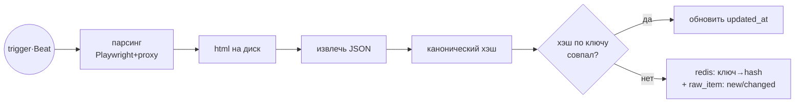
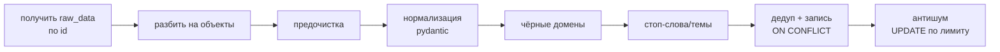
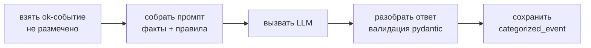
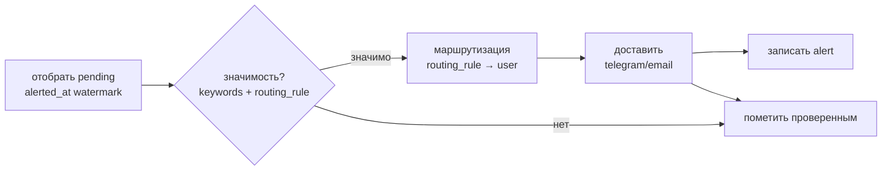
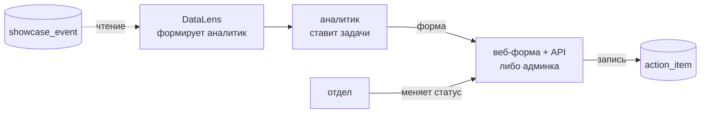
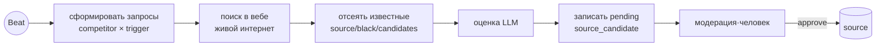

# Система автоматизированной конкурентной разведки «Кодик» — рабочие заметки по бэкенду

Документ фиксирует всё, что проговорили при разборе ТЗ и проектировании конвейера.
Роль автора: **разработчик бэкенда**. Первоисточник требований: `ТЗ_бизнес_процессы_и_RoadMap.docx`.
Здесь — описание всех 7 бизнес-процессов, схемы конвейеров и полная модель данных (DBML).

---

## 0. Что за система (верхний уровень)

Система автоматизированной **конкурентной разведки** (competitive intelligence) — ETL/ELT-конвейер,
который заменяет ручной мониторинг конкурентов. Работает **сама по расписанию, без человека в цикле**.
Аналитик остаётся контролёром качества и принимает решения.

Целевой поток (TO-BE):

```
Автосбор по триггерам → очистка + дедупликация → LLM-категоризация → витрина (СУБД) → BI-дашборд + алерты → постановка задач для менеджеров
```

### Стек

| Слой | Технологии |
|------|-----------|
| Сбор | `httpx` (async) + `pydantic`; `Playwright` для RPA-сайтов |
| Оркестрация | **Celery + Redis** (очередь, ретраи, изоляция сбоев), Celery Beat (расписание) |
| API-слой / админка | **FastAPI + SQLAlchemy (async) + pydantic**; авто-админка — **SQLAdmin или FASTAdmin** (НЕ DRF) |
| Хранилище | **PostgreSQL** (источник правды), **Redis** (отпечатки/кэш), файлы/MinIO (сырой HTML) |
| LLM (BP-3, BP-7) | отдельный сервис; обогащаем только new/changed |
| BI (BP-6) | Яндекс DataLens / Metabase — подключается к витрине напрямую (не наша зона) |

**Почему FastAPI, а не DRF:** весь конвейер асинхронный (`httpx`, async SQLAlchemy, Playwright),
DRF синхронный и использует свои сериализаторы вместо pydantic. FastAPI + SQLAdmin закрывают и API, и админку,
pydantic переиспользуется как есть. Запасной вариант при django-центричности — Django Ninja (pydantic + async), но не DRF.

### Раскладка хранилищ (главный принцип)

| Данные | Где | Зачем |
|--------|-----|-------|
| Сырой HTML-снапшот | Файл / MinIO | аудит, переразбор без повторного захода на сайт |
| Слои bronze/silver/gold | **Postgres** | источник правды, история, запросы |
| Хэши дедупа, счётчики | **Redis** | быстрые проверки «менялось/нет», TTL |
| Справочники (правила, реестры) | Postgres | настраиваемость без кода |

**Redis — НЕ хранилище данных и НЕ история.** История — только в Postgres. Redis можно стереть — пересоберётся.

### Слои данных

```
raw_item (bronze) → normalized_item (silver) → categorized_event (gold) → showcase_event (витрина/представление)
```

---

## Обзор 7 процессов

| BP | Что делает | Триггер | Зона бэкенда |
|----|-----------|---------|--------------|
| BP-1 | Сбор сырья из источников по триггерам | Celery Beat (расписание) | да (ядро) |
| BP-2 | Очистка, нормализация, дедуп, фильтр шума | новые строки в `raw_item` | да |
| BP-3 | LLM-категоризация (приоритет, категория, тональность…) | новые `ok` в `normalized_item` | datasince |
| BP-4 | Витрина (плоская таблица под BI) | новые строки в `categorized_event` | да |
| BP-5 | Детектор значимых событий + алертинг + маршрутизация | новые строки в витрине | да |
| BP-6 | Дашборды + план действий | человек | DataLens + тонкий бэкенд (план действий) + front|
| BP-7 | Админка (CRUD справочников) + агент расширения источников | Beat / человек | да |

---

## BP-1 · Сбор сырья(Backend)

**Назначение:** автоматически получить сведения о конкурентах из внешних источников по триггерам.

**Одна задача Celery** (внутри — обычные функции по шагам). Гранулярность ретраев — не отдельными задачами,
а выборочно: сетевые ошибки ретраим (`tenacity`), ошибки разбора НЕ ретраим (пишем `status=error`).
Опционально можно разбить на 2 задачи (fetch / parse), чтобы разбор повторялся от сохранённого HTML без захода на сайт.

### Pipeline



### Итог BP-1 — строка в `raw_item`

Одна строка = одна выгрузка (снимок страницы).

| поле | значение (пример) |
|---|---|
| `id` | `1` |
| `search_task_id` | `1` — ссылка на задачу-конфиг (он же ключ в Redis) |
| `status` | `new` |
| `content_hash` | `a3f9c1e8b2...` — хэш канонического JSON |
| `raw_data` | JSONB — см. ниже |
| `html_file_path` | `/snapshots/1/2026-07-18T10-00.html` |
| `source_request_url` | `https://hh.ru/search/vacancy?text=Бегемот+Python` |
| `error_message` | `NULL` |
| `created_at` | `2026-07-18 10:00:00` |
| `updated_at` | `2026-07-18 10:00:00` |

Параллельно в Redis: `search_task:1 → "a3f9c1e8b2..."`, на диске — HTML-снимок.

### Содержимое `raw_data`

```jsonc
{
  "meta": {
    "search_task_id": 1,                              // ссылка на задачу-конфиг (= ключ в Redis)
    "source": "hh.ru",                                // с какого ресурса собрали
    "competitor": "Бегемот",                          // по какому конкуренту искали
    "trigger": "Python",                              // по какому слову (может быть null)
    "source_request_url": "https://hh.ru/search/...", // НАШ поисковый запрос, один на всю выгрузку
    "fetched_at": "2026-07-18T10:00:00Z"              // время съёма; в хэш НЕ включаем (иначе всегда changed)
  },
  "items": [                                          // список событий с одной страницы
    {
      "url":    "https://hh.ru/vacancy/101",          // ссылка на КОНКРЕТНОЕ событие -> dedup_key + media_domain
      "title":  "Python-разработчик",                 // заголовок -> вход для стоп-слов
      "text":   "Описание вакансии...",               // тело -> вход для стоп-слов
      "published_at": "18 июля 2026",                 // сырая дата СТРОКОЙ (имя = колонке); BP-2 парсит в date
      "region": "г. Москва",                          // сырое имя региона (не id) -> lookup в region -> region_id
      "media_name": null,                             // имя публикатора (имя = колонке): у hh пусто, у новостей = СМИ
      "extra":  {"salary": "150000-200000 руб."}      // источник-специфичные СЫРЫЕ факты; {} если их нет (напр. новости). У hh здесь зарплата -> нормализуется в extra.salary_from/salary_to/currency
    }
  ]
}
```

`meta.source_request_url` (наш запрос) и `items[].url` (ссылка на событие) — **два разных URL**, путать нельзя.


### Ключевые решения

1. **Перед стартом заполнить справочники** — `competitor`, `source`, `trigger` и матрицу `search_task`.
   Без них Beat нечего перебирать: он читает активные строки `search_task` и на каждую ставит задачу в очередь.
2. **Ключ и хэш оставляем как есть.** Ключ Redis = `search_task_id`, значение = последний хэш;
   хэш считаем от **канонического** JSON (sorted keys, без плавающих полей вроде `fetched_at`).
   Проверка = **GET + сравнение значений**, а не проверка существования ключа.
3. **Статусы:**
   - **новый** JSON (ключа в Redis нет) → **новая строка**, `status = new`;
   - **повтор** (хэш совпал) → строку не создаём и `status` **не трогаем**, обновляем только `updated_at`;
   - **обновлённый** (хэш другой) → **новая строка** с новыми данными и `status = changed`;
     старая остаётся историей, в Redis перезаписываем хэш.
4. **`error`** — строка с пустым контентом (поля nullable) + `error_message`. Пишем только после исчерпания ретраев.
5. **HTML** — сохраняем всегда (резерв для переразбора); при совпадении хэша (ничего не изменилось) дубль HTML удаляем.

**Таблицы:** `competitor`, `source`, `trigger`, `search_task` (M2M-конфиг, id = ключ Redis), `raw_item`.

---

## BP-2 · Очистка, дедупликация, фильтрация(Backend)

**Назначение:** привести сырьё к единому виду, отсечь дубли и нерелевантное до категоризации.

**Отдельная задача Celery**, триггерится новыми строками `raw_item`. Между этапами передаётся **id**, а не JSON;
BP-2 сам читает `raw_data` по id (отвязка от BP-1, можно переразобрать).
### Pipeline


### Итог BP-2 — строка в `normalized_item`

Один объект из `raw_data.items[]` → одна строка. Только ФАКТЫ, смыслов тут нет.

| поле | значение (пример) |
|---|---|
| `id` | `1` |
| `raw_item_id` | `1` — ссылка НАЗАД на сырьё (drill-down) |
| `competitor_id` | `3` → «Бегемот» (lookup в `competitor`) |
| `region_id` | `7` → «Москва» (lookup в `region`) |
| `source_id` | `1` → «hh.ru» (из `raw_item → search_task`) |
| `published_at` | `2026-07-18` (из `"18 июля 2026"`) |
| `title` | `Python-разработчик` |
| `media_name` | `NULL` — у hh публикатора нет |
| `media_domain` | `hh.ru` — вырезан из `items[].url` |
| `url` | `https://hh.ru/vacancy/101` |
| `text` | `Описание вакансии...` — тело; вход для стоп-слов и для промпта BP-3 |
| `extra` | `{"salary_from":150000,"salary_to":200000,"currency":"RUB"}` — источник-специфичные факты |
| `dedup_key` | `9f2a4c7e...` — хэш бизнес-полей (см. п.4) |
| `status` | `ok` |
| `reject_reason` | `NULL` |
| `created_at` | `2026-07-18 10:05:00` |


### Ключевые решения

**1. Перед стартом заполнить справочники:** `region` (сырое имя → красивое), `black_domain` (домены-публикаторы
в чёрном списке), `stop_word` (стоп-слова / стоп-темы / ложные срабатывания, по `type`), `topic_limit` (лимиты анти-шума).
`competitor`, `source`, `trigger` уже заполнены с BP-1.

**2. Проверка на чёрные списки.**
Смотрим **не колонки `raw_item`**, а поле внутри сырого JSON — ссылку самого события:

```
raw_data["items"][i]["url"]  →  urlparse(url).netloc  →  сравниваем с  black_domain.domain (is_active = true)
```

Совпало → заводим в памяти `status = "rejected"`, `reject_reason = "black_domain"` и делаем **короткое замыкание**:
стоп-слова уже **не проверяем** (смысла нет, объект и так отсеян), сразу идём в дедуп и сохраняем строку с этим статусом.
Дедуп при этом всё равно нужен — чтобы не спамить БД повторами одного и того же отсеянного события.

Нюанс: у hh все `media_domain` = `hh.ru`, поэтому фильтр там холостой. Он работает на новостных источниках,
где в одной выдаче намешаны разные публикаторы.

**3. Проверка на стоп-слова** (только если ЧС не сработал).
Смотрим текстовые поля события:

```
raw_data["items"][i]["title"] + ["text"]  →  lowercase  →  ищем вхождения  stop_word.phrase (is_active = true)
```

Совпало → `status = "rejected"`, а `reject_reason` берём из `stop_word.type`: `stop_word` / `stop_topic` / `false_positive`.
Дальше так же короткое замыкание → дедуп → сохранение с этим статусом.

**4. Дедуп — ключ не URL, а хэш бизнес-полей.**
URL как ключ не годится: одна и та же новость на трёх сайтах даёт **три разных URL**, и по URL они не склеятся.
Поэтому `dedup_key` = хэш от полей, которые одинаковы у одного события независимо от площадки:

```python
import hashlib, re


def norm(s: str) -> str:  # без этого «Бегемот» и "Бегемот" дадут разные хэши
    s = (s or '').lower()
    s = re.sub(r'[^\w\s]', '', s)  # убрать кавычки/пунктуацию
    return re.sub(r'\s+', ' ', s).strip()  # схлопнуть пробелы


dedup_key = hashlib.sha256(
    f'{competitor}|{norm(title)}|{published_at}|{region}'.encode()
).hexdigest()
```

**Отдельного SELECT «а есть ли уже такой?» не делаем.** Проверку выполняет сама база:
на `dedup_key` стоит **UNIQUE**, а поведение при совпадении задаёт `ON CONFLICT`:

- **`ON CONFLICT DO NOTHING`** — обычный инкрементальный прогон. Дубль молча пропускается,
  остальная пачка вставляется (без этого вся вставка упала бы с ошибкой на первом же повторе).
- **`ON CONFLICT DO UPDATE`** — переразбор того же сырья с **изменёнными правилами**
  (поправили справочники и прогнали заново): обновляет `status` / `reject_reason` у существующей строки, дублей не плодит.

Две честные оговорки:
- Хэш ловит только **точные** совпадения заголовка. Переформулированную перепечатку
  («Бегемот выиграл тендер» vs «Компания Бегемот победила в конкурсе») он не склеит — для этого нужен нечёткий
  матч (триграммы / simhash), это задел на потом.
- Обратный риск: для **вакансий** два разных объявления с одинаковым заголовком, регионом и датой у одного конкурента
  схлопнутся в одно. Поэтому для источников с надёжным уникальным URL и без перепечаток (джоб-борды, реестры)
  в хэш добавляем ещё и `url`. Стратегию дедупа логично хранить на уровне источника.

**5. Антишум** — аггрегатный фильтр, идёт ПОСЛЕ дедупа и ПОСЛЕ вставки.
Смотрим уже лежащие в БД строки и сравниваем со справочником:

```
normalized_item (status = 'ok')  →  группируем по полю из topic_limit.scope
                                     (competitor_id / media_domain / region_id)
                                     за окно topic_limit.window (прогон / день / неделя)
                                  →  сравниваем COUNT группы с topic_limit.max_count
```

Всё сверх лимита (самые старые в группе) получает `UPDATE ... status = 'rejected', reject_reason = 'noise_limit'`.

Почему после дедупа и после вставки: считать надо **уникальные** события, а окно «неделя» включает строки
из **прошлых прогонов**, которые лежат в БД, а не в текущей пачке в памяти.

**Отсеянное не удаляем** — во всех трёх фильтрах ставим `status = rejected` + причину.
Аналитик разбирает отсев и настраивает правила (цикл «контроль качества → правила» из ТЗ).


**6. ИИ в BP-2 не нужен** — правила дешёвые, прозрачные и правятся аналитиком без кода.
Семантику («Бегемот» компания vs животное) добивает LLM в BP-3; тащить её сюда — дублировать BP-3.

**Таблицы:** справочники `region`, `black_domain`, `stop_word` (по `type`), `topic_limit`; выход — `normalized_item` (silver, только ФАКТЫ).

---

## BP-3 · LLM-категоризация(Datasince)

**Назначение:** разметить каждое событие (приоритет, категория, тональность, отдел…) по правилам аналитика.

**Отдельная задача Celery**. Гоним через LLM только `status=ok` и только **некатегоризированные** (LLM дорогой). Ретраи на сбои API.

### Итог BP-3 — строка в `categorized_event`

Одна строка фактов ↔ одна строка разметки. В колонке «кто» видно, что именно делает LLM, а что код.
### Pipeline


| поле | значение (пример) | кто заполняет |
|---|---|---|
| `id` | `1` | БД |
| `normalized_item_id` | `1` → «Бегемот выиграл тендер в школы Калуги» | код |
| `priority` | `p2` | **LLM** |
| `category_id` | `3` → «PR-активность конкурента» | **LLM** даёт название → код ищет id |
| `tonality` | `positive` | **LLM** |
| `media_index` | `47.10` | зависит от источника, см. решение 3 |
| `action` | `подготовить ответный PR-кейс` | **LLM** (черновик) |
| `deadline` | `2026-07-25` | **код**: дата события + 7 дней (П2) |
| `department_id` | `2` → «PR» | **LLM** даёт название → код ищет id |
| `comment` | `федеральное СМИ, топ события недели` | **LLM** |
| `llm_model` | `gpt-4o-mini` | код |
| `prompt_version` | `v1.2` | код |
| `categorized_at` | `2026-07-18 10:10:00` | код |

Атрибуты события из ТЗ закрыты полностью: факты (дата, заголовок, источник, регион, конкурент) — в `normalized_item`,
смыслы (приоритет, категория, тональность, действие, срок, отдел, комментарий) — здесь. Добавлять поля не нужно.


### Ключевые решения

1. **Заполнить справочники:** `category` (список категорий берётся из ТЗ) и `department` (отделы заказчика).
   Приоритеты П1–П4 и тональность — `enum` в коде (`priority_level`, `tonality_level`), справочники под них не нужны.
2. **Факты vs смыслы:** BP-1/BP-2 собирают ФАКТЫ (что на странице). Приоритет/категория/тональность — это СМЫСЛЫ,
   их на странице нет, их присваивает LLM. Отдельная таблица `categorized_event` (1:1 через `unique` на `normalized_item_id`),
   а не колонки в `normalized_item` — чтобы факты и смыслы жили раздельно: перекатегоризация не трогает факты,
   хранится версия модели/промпта, а `rejected`-события разметку не получают вообще.
3. **Промпт = факты события + правила из справочников** (закрытый список категорий/отделов). Модель возвращает
   **название**, код делает lookup и получает `id`; отсебятину ловим на валидации.
4. **`deadline` считаем в коде** (П1 = дата+48ч, П2 = +7 дней), а не доверяем LLM арифметику дат.
5. **`media_index` — не выход LLM.** Приходит готовым полем из лицензионного агрегатора (Медиалогия и т.п.);
   без такого источника поле остаётся пустым. Просить число у LLM нельзя — она его выдумает.

**Таблицы:** справочники `category`, `department`; enum `priority_level`, `tonality_level`; выход — `categorized_event` (gold).

---

## BP-4 · Витрина(Часть деалает backend или datasince)

**Назначение:** накопить размеченные события в плоской структуре под BI.

**Отдельная задача Celery**, триггерится новыми `categorized_event`.

### Итог BP-4 — строка в `showcase_event` (плоская витрина)

Одно событие = одна широкая строка. Всё в одном месте, id заменены на читаемые имена — BI читает без джойнов.

| поле | значение (пример) | откуда взялось |
|---|---|---|
| `id` | `1` | БД |
| `categorized_event_id` | `1` | ключ для UPSERT (одна строка на размеченное событие) |
| `raw_item_id` | `1` | drill-down до сырья |
| `published_at` | `2026-07-18` | `normalized_item.published_at` |
| `title` | `Компания «Бегемот» выиграла тендер в школы Калуги` | `normalized_item.title` |
| `media` | `Big-news.ru` | `normalized_item.media_name` |
| `region` | `Калуга` | `region.name_display` по `region_id` |
| `macro_region` | `ЦФО` | `region.macro_region` |
| `latitude` | `54.53333` | `region.latitude` — метка на карте |
| `longitude` | `36.26667` | `region.longitude` — метка на карте |
| `competitor` | `Бегемот` | `competitor.name` по `competitor_id` |
| `source_url` | `https://big-news.ru/news/123` | `normalized_item.url` |
| `priority` | `П2` | `categorized_event.priority` |
| `category` | `PR-активность конкурента` | `category.name` по `category_id` |
| `tonality` | `позитивная` | `categorized_event.tonality` |
| `media_index` | `47.10` | `categorized_event.media_index` |
| `action` | `подготовить ответный PR-кейс` | `categorized_event.action` |
| `deadline` | `2026-07-25` | `categorized_event.deadline` |
| `department` | `PR` | `department.name` по `department_id` |
| `comment` | `федеральное СМИ, топ события недели` | `categorized_event.comment` |
| `updated_at` | `2026-07-18 10:15:00` | БД |

Это ровно строка из целевого xlsx-отчёта.

### Pipeline


### Ключевые решения

1. **Новых справочников не нужно.** Используем уже заполненные — `region`, `competitor`, `category`, `department` —
   и только для того, чтобы подставить **имена вместо id**.
2. **Витрина денормализована:** `region_id → «Калуга»`, `category_id → «PR-активность»`. Плюс `raw_item_id` —
   переход к исходнику из любой строки (требование прозрачности ТЗ).
3. **РЕАЛИЗОВАНО физической таблицей с UPSERT** (вариант с VIEW рассматривали и отклонили).

   **VIEW** — сохранённый SQL-запрос, который снаружи выглядит как таблица, но данных не хранит:
   при каждом обращении Postgres на лету гоняет JOIN. Ничего не дублируется и всегда актуально,
   но на объёме дашборд начинает ждать, и колонки нельзя проиндексировать.

   **Физическая таблица** — настоящая таблица, куда задача BP-4 пишет по одной широкой строке на событие.
   *UPSERT* = `INSERT ... ON CONFLICT DO UPDATE` — вставить, а если строка уже есть, обновить (тот же приём, что в BP-2).
   *Инкрементально* = дописываем только новые и изменившиеся события, а не пересобираем всю витрину с нуля.
   Быстро для BI, индексируется, контракт колонок стабилен — этого и требует ТЗ. Взяли её и на демо тоже:
   поддерживать нечего, а поведение одинаковое с продом.
4. **Инкремент ловит и перекатегоризацию.** В работу берётся событие, которого нет в витрине, ИЛИ то,
   у которого `categorized_at > showcase_event.updated_at` — то есть BP-3 переразметил уже опубликованное.
   Полной перезагрузки витрины не бывает.

   `updated_at` ставится временем Python (`datetime.now(UTC)`), а НЕ `now()`: в Postgres `now()` возвращает
   время начала транзакции, и при сборке в одной транзакции с BP-3 строка получила бы отметку РАНЬШЕ
   `categorized_at` и осталась бы «устаревшей» навсегда.
5. **Витрина — производная таблица, руками её не правят.** Источник правды для приоритета —
   `categorized_event.priority` (там enum, ошибиться нельзя). Правка прямо в витрине не упадёт с ошибкой,
   но будет молча затёрта следующим UPSERT'ом — это хуже явного отказа.
6. **Нужно на дашборде — значит, лежит в витрине.** Отсюда `latitude`/`longitude`: заставлять BI джойнить
   `region` неправильно (связь пошла бы по строковому имени, плюс второй датасет и права в DataLens).
7. **Контракт витрины** (набор колонок) согласуется с аналитиком/PM ДО старта BI.
   Внутренние имена таблиц не согласуются — это потроха.

   Осторожно: добавление колонки в витрину НЕ подхватывается инкрементом (схема меняется, а `categorized_at`
   нет) — после такой миграции нужен разовый пересбор. Подробности — в `src/bp4/BP4_README.md`.

**Таблица:** `showcase_event`. **Код:** `src/bp4/` — `pipeline.py`, `crud.py`, `constants.py`.

---

## BP-5 · Детектор событий + алертинг(Бэкенд)

**Назначение:** своевременно уведомить ответственных о значимых событиях.

**Отдельная задача Celery** (пока не подключена — конвейер вызывается напрямую, как `run_bp2`/`run_bp4`),
триггерится новыми/изменившимися строками витрины. Два режима: П1 — мгновенно, П2 — сводкой (Celery Beat).

### Итог BP-5 — строка в `alert`

Журнал отправленного: что распознали, кому и куда ушло, с каким результатом. Одна строка = одна доставка
**одному получателю**.

| поле | значение (пример) | откуда |
|---|---|---|
| `id` | `1` | БД |
| `showcase_event_id` | `501` | по какому событию витрины сработало |
| `event_type_id` | `1` → «судебный/надзорный риск» | результат детекции (шаг 2) |
| `priority` | `p1` | снимок приоритета события |
| `user_id` | `7` → «Иванов Пётр» | из `routing_rule` |
| `channel_id` | `1` → «telegram» | из `routing_rule` |
| `mode` | `немедленно` | из `routing_rule` |
| `status` | `sent` | `queued` → `sent` / `failed` |
| `error_message` | `NULL` | заполняется при `failed` |
| `created_at` | `2026-07-18 10:20:00` | когда завели |
| `sent_at` | `2026-07-18 10:20:03` | когда реально доставили |

### Pipeline



### Ключевые решения

1. **Заполнить справочники:** `event_type` (типы значимых событий + слова-маркеры), `channel` (telegram, email,
   dashboard), `user` (конкретные получатели), `routing_rule` (матрица: тип + приоритет → получатель + канал +
   режим). `department` уже заполнены с BP-3.

2. **Критерий «событие нужно проверить» — watermark на самой витрине, не по журналу `alert`:**

   ```
   showcase_event.alerted_at IS NULL  OR  showcase_event.updated_at > showcase_event.alerted_at
   ```

   `showcase_event → alert` — связь 1:N, и легитимно N=0 (проверили, значимых типов не нашли). Если критерием
   «новое» считать «id отсутствует в `alert`», такое событие проверялось бы заново на каждом прогоне впустую —
   по журналу результатов нельзя отличить «ещё не проверено» от «проверено, но не значимо». `alerted_at`
   проставляется детектором **независимо от результата**, тот же приём, что `raw_item.updated_at` в BP-1
   и `categorized_at > showcase_event.updated_at` в BP-4.

3. **Значимость — не хардкод «p1/p2», а сам справочник `routing_rule`:**

   ```
   showcase_event.title  →  ищем вхождения слов из  event_type.keywords
   ```

   Нашёлся тип → ищем в `routing_rule` строки на пару (тип, приоритет события). Нашлись → событие значимо.
   Не нашлись → не значимо, алерта нет. Порог — это то, какие строки аналитик завёл в `routing_rule`, а не
   константа в коде: если завтра решат алертить и на П3 (как уже сделано для «расширение» в демо-данных) —
   это новая строка справочника, а не правка кода. Единственная трактовка, которая согласуется с требованием
   ТЗ «настраивается без доработки кода».

   Ищем **по полю `keywords`**, а не по `name`. Оба поля нужны, но для разного: `keywords` — то, чем **ловим**
   (`[«прокуратура», «суд», «иск», «нарушения»]` — массив, не строка через запятую, по образцу
   `region.name_aliases`), `name` — как этот тип **называется** (`«судебный/надзорный риск»`), для отчёта.

   Базово это `if kw in title` — без LLM, дёшево, правит аналитик. Когда начнёт ловить лишнее («суд» в «присуждать») —
   апгрейд: регэксп с границами слова → лемматизация (pymorphy2) → полнотекстовый поиск Postgres.

4. **Адресат — конкретный `user`, а не `department`.** Список получателей курируется вручную и может не совпадать
   со штатом отдела («сегодня трое, завтра один»), поэтому отдел не годится источником рассылки — он не говорит,
   КОМУ конкретно слать. Гибкость достигается тем же способом, каким `routing_rule` и так умеет несколько каналов
   на одну пару (тип, приоритет) — несколькими строками:

   | event_type_id | priority | user_id | channel_id | mode |
   |---|---|---|---|---|
   | 1 — судебный риск | `p1` | 7 — Иванов Пётр | 1 — telegram | `instant` |
   | 1 — судебный риск | `p1` | 7 — Иванов Пётр | 2 — email | `instant` |
   | 1 — судебный риск | `p1` | 8 — Петрова Анна | 1 — telegram | `instant` |

   Детектор определил `event_type_id = 1`, у события `priority = p1`. Ищем правило по этой паре:

   ```sql
   SELECT user_id, channel_id, mode
   FROM routing_rule
   WHERE event_type_id = 1 AND priority = 'p1' AND is_active = true;
   ```

   Вернулись **три строки** → значит доставок тоже три, и в `alert` появятся три записи
   (`unique(showcase_event_id, channel_id, user_id)` это разрешает — ключ по тройке событие+канал+получатель).

   Отдел не теряется — он виден через `user.department_id`, справочно, не как поле маршрутизации.

5. **`mode` — способ доставки, а не статус.** Значений два (ТЗ: «П1 доставляется незамедлительно, П2 — в составе
   регулярной сводки»):
   - `instant` — отправляем **сразу** по событию;
   - `digest` — **не шлём сразу**, строка ложится со `status=queued`, а отдельная джоба по расписанию (Celery Beat,
     пока не реализована) собирает накопленное и отправляет одним письмом.

   Копируется из найденного правила `routing_rule.mode`. Нужен именно в `alert`, потому что джоба-сводка ищет
   свои задания запросом `WHERE mode='digest' AND status='queued'`.

   Отдельная таблица под него **не нужна** — набор значений фиксирован ТЗ, доп. атрибутов нет, аналитик его не
   расширяет. Поэтому `enum delivery_mode`, как и `alert_status` (`queued/sent/failed`).

6. **Порядок доставки:** сначала пишем `alert` со `status=queued` → отправляем (сейчас — заглушка, без реального
   обращения к API) → обновляем статус (`sent`/`failed`). Не наоборот: упадём после отправки, но до записи —
   отправим второй раз. `unique(showcase_event_id, channel_id, user_id)` — защита от дублей.

7. **`priority`, `mode` и `user_id` в `alert` — снимок факта**, а не ссылка: правило завтра поменяют, пользователь
   сменит отдел — а история должна остаться прежней.

**Таблицы:** справочники `event_type`, `channel`, `user`, `routing_rule`; журнал `alert`.
**Код:** `src/bp5/` — `pipeline.py`, `crud.py`.

---

## BP-6 · Аналитика и план действий(Аналитик + Font)

**Назначение:** дать пользователям готовую картину + вести реакцию на события.

**В основном НЕ разработка.** Дашборды, карта, паспорт конкурента, роли/RLS, веб-доступ — всё это **DataLens**
(подключается к витрине напрямую, без API). Единственный кусок с записью — **план действий**.

### Схема (человеко-ориентированный цикл, Celery нет)



Витрина только **читается**; задачи пишутся в **свою** таблицу `action_item`.

### Ключевые решения

1. **DataLens только читает.** «Статус отражается в системе» (ТЗ) → нужна запись → отдельная таблица `action_item`.
   Это НЕ CRM — минимальный трекер: список задач + смена статуса.
2. **Отдельную форму можно не делать.** `action_item` регистрируется в той же **админке** (SQLAdmin), что и справочники BP-7,
   и аналитик получает готовый CRUD-экран без единой строчки фронтенда. Кастомная апка нужна, только если
   с задачами будут работать **отделы**: «видеть только свои строки и менять только статус» — это тонкие права,
   для которых админка уже не годится.
3. **Разграничение прав «до уровня строк» (RLS)** — встроено в DataLens, настраивает BI-админ. Опционально дублируется Postgres-RLS.
4. **Как отделы узнают о задаче — ТЗ не описывает.** Варианты: заходят в систему сами (с ролевым ограничением),
   либо переиспользуем каналы из BP-5 и шлём уведомление в telegram/почту при заведении задачи.

**Таблица:** `action_item` (поля строго из ТЗ: задача → отдел → срок → ожидаемый результат → статус).

---

## BP-7 · Сопровождение и расширение(Back + datasince)

**Назначение:** держать реестры/правила актуальными без остановки системы. Два блока: **админка** и **агент источников**.

### Админка = CRUD над справочниками

Вся система **data-driven**: поведение задаётся данными в справочниках, не кодом. Админка — просто редактор этих таблиц
(`competitor`, `trigger`, `source`, `black_domain`, `stop_word`, `routing_rule`, …). Берём **SQLAdmin**
(авто-генерация CRUD из моделей), CRUD руками не пишем. Так закрывается «добавление без кода» из ТЗ.

### Агент расширения источников



### Ключевые решения

- **web ≠ показ страницы** — это выход в **живой интернет** (поисковый API или LLM с браузингом). Обычный LLM новые сайты
  не знает (знания заморожены), внутри БД их тоже нет — искать надо снаружи.
- Агент только **предлагает** (`source_candidate`, pending). В `source` попадает **только через ручную модерацию** (правило ТЗ). Автоподключения нет.
- **Парсинг новых источников ≠ строка в `source`.** Каждый сайт устроен по-своему → **паттерн «адаптер»**: у источника свой парсер,
  `source` указывает `parser_type`/`access_type`. Новый источник того же типа (ещё одно СМИ) → переиспользуем общий адаптер (RSS/экстрактор);
  принципиально новая структура → разработчик пишет адаптер (это и есть «одна интеграция» из ТЗ). Fallback для «длинного хвоста» —
  LLM-экстракция полей из HTML. Для демо (1 источник) — один парсер под hh.ru; многосорсность — Этап 2.

**Таблица:** `source_candidate` (очередь модерации). `source` в проде расширяется полями `access_type`, `parser_type`, `base_url`, `is_active`.

---

## Дорожная карта

- **Этап 0** — инфраструктура, правила категоризации (BP-3 определён), модель данных витрины (контракт).
- **Этап 1 (демо)** — полный цикл BP-1→BP-2→BP-3→BP-4 на ОДНОМ простом источнике до дашборда.
- **Этап 2** — все источники, фильтр шума, витрина, алертинг (BP-1,2,4,5 в проде).
- **Этап 3** — автономность, агент расширения источников, полный BI (BP-6,7).

## Открытые вопросы к PM/аналитикам

1. Контракт витрины (точный список колонок) — до старта BI.
2. Какая LLM для BP-3/BP-7 (облако/локально, юр. чистота, бюджет).
3. Какой ОДИН источник берём на Этап 1 (проще — открытый API).
4. Эталонный набор для проверки категоризации (даёт аналитик).
5. Будут ли **отделы** работать с задачами внутри системы, или им достаточно уведомления в мессенджер,
   а статус проставляет аналитик? От ответа зависит, хватит ли админки или нужна кастомная апка с ролями.
5. Каналы доставки алертов и матрица маршрутизации (отделы) — от заказчика.

---

## Полная модель данных (DBML для dbdiagram.io)

Вынесена в отдельный файл — `DIAGRAMM_IO.md` — так удобнее копировать
целиком в редактор на dbdiagram.io.
